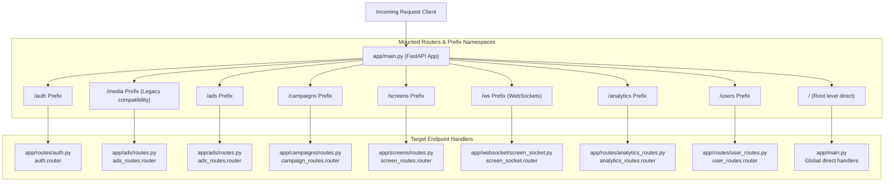

# XARA Smart Signage: Backend Router Architecture Map

This document maps out the request routing hierarchy of the XARA Smart Signage Platform backend. It provides a visual and structured map showing how `app/main.py` imports routers, configures prefix namespaces, and dispatches requests to individual route controllers.

---

## 🗺️ Request Routing Flow Diagram



---

## 📂 Router Mounting Directory

Below is the detailed hierarchy mapping each router in `app/main.py` down to its specific prefix namespace and endpoint controllers.

### 1. `auth.router`
* **Namespace Prefix**: `/auth`
* **Source Module**: `app/routes/auth.py`
* **Flow Mapping**:
  ```text
  app/main.py
  └── auth.router (prefix: /auth)
      ├── POST /signup           --> signup()
      ├── POST /login            --> login()
      ├── GET  /me               --> read_current_user()
      ├── GET  /admin/dashboard  --> admin_dashboard()
      └── GET  /user/dashboard   --> user_dashboard()
  ```

---

### 2. `ads_routes.router` (Media Route - Legacy Frontend Compatibility)
* **Namespace Prefix**: `/media`
* **Source Module**: `app/ads/routes.py`
* **Flow Mapping**:
  ```text
  app/main.py
  └── ads_routes.router (prefix: /media)
      ├── POST /                 --> upload_ad()
      ├── POST /upload           --> upload_ad()
      ├── GET  /                 --> get_all_ads()
      ├── GET  /my-ads           --> get_my_ads()
      ├── GET  /{ad_id}          --> get_ad_details()
      └── DELETE /{ad_id}        --> delete_ad()
  ```

---

### 3. `ads_routes.router` (Advertisements Route - Modern Frontend Standard)
* **Namespace Prefix**: `/ads`
* **Source Module**: `app/ads/routes.py`
* **Flow Mapping**:
  ```text
  app/main.py
  └── ads_routes.router (prefix: /ads)
      ├── POST /                 --> upload_ad()
      ├── POST /upload           --> upload_ad()
      ├── GET  /                 --> get_all_ads()
      ├── GET  /my-ads           --> get_my_ads()
      ├── GET  /{ad_id}          --> get_ad_details()
      └── DELETE /{ad_id}        --> delete_ad()
  ```

---

### 4. `campaign_routes.router`
* **Namespace Prefix**: `/campaigns`
* **Source Module**: `app/campaigns/routes.py`
* **Flow Mapping**:
  ```text
  app/main.py
  └── campaign_routes.router (prefix: /campaigns)
      ├── POST /                 --> create_campaign()
      ├── GET  /                 --> get_campaigns()
      ├── GET  /{campaign_id}    --> get_campaign_details()
      ├── PATCH /{campaign_id}   --> update_campaign()
      ├── PUT  /{campaign_id}    --> update_campaign()
      └── DELETE /{campaign_id}  --> delete_campaign()
  ```

---

### 5. `screen_routes.router`
* **Namespace Prefix**: `/screens`
* **Source Module**: `app/screens/routes.py`
* **Flow Mapping**:
  ```text
  app/main.py
  └── screen_routes.router (prefix: /screens)
      ├── POST /                 --> create_screen()
      ├── POST /create           --> create_screen()
      ├── GET  /                 --> get_screens()
      ├── GET  /live             --> get_live_monitoring()
      ├── GET  /{screen_id}      --> get_screen_by_id()
      ├── PUT  /{screen_id}      --> update_screen()
      ├── DELETE /{screen_id}    --> delete_screen()
      ├── POST /assign-ad        --> assign_ad()
      ├── POST /assign-multiple-ads -> assign_multiple_ads()
      ├── PUT  /{screen_id}/mode --> update_screen_mode()
      └── GET  /{screen_id}/current-media -> get_current_media()
  ```

---

### 6. `screen_socket.router`
* **Namespace Prefix**: `/ws`
* **Source Module**: `app/websocket/screen_socket.py`
* **Flow Mapping**:
  ```text
  app/main.py
  └── screen_socket.router (prefix: /ws)
      └── WS   /{screen_id}      --> screen_websocket()
  ```

---

### 7. `analytics_routes.router`
* **Namespace Prefix**: `/analytics`
* **Source Module**: `app/routes/analytics_routes.py`
* **Flow Mapping**:
  ```text
  app/main.py
  └── analytics_routes.router (prefix: /analytics)
      ├── POST /                 --> record_analytics()
      ├── GET  /                 --> get_user_analytics()
      ├── GET  /reports          --> get_user_reports()
      ├── GET  /global           --> get_global_analytics()
      ├── GET  /screens          --> get_screens_analytics()
      └── GET  /users            --> get_users_analytics()
  ```

---

### 8. `user_routes.router`
* **Namespace Prefix**: `/users`
* **Source Module**: `app/routes/user_routes.py`
* **Flow Mapping**:
  ```text
  app/main.py
  └── user_routes.router (prefix: /users)
      ├── GET  /                 --> get_all_users()
      ├── PATCH /{user_id}/activate   --> activate_user()
      ├── PATCH /{user_id}/deactivate --> deactivate_user()
      └── DELETE /{user_id}      --> delete_user()
  ```

---

### 9. Global Application Context (Direct Directives)
* **Namespace Prefix**: `/` (Root Namespace)
* **Source Module**: `app/main.py`
* **Flow Mapping**:
  ```text
  app/main.py
  ├── GET  /reports              --> get_reports_api()
  ├── GET  /health               --> health_check()
  └── GET  /                     --> root()
  ```
